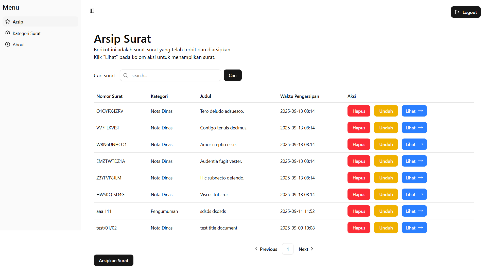
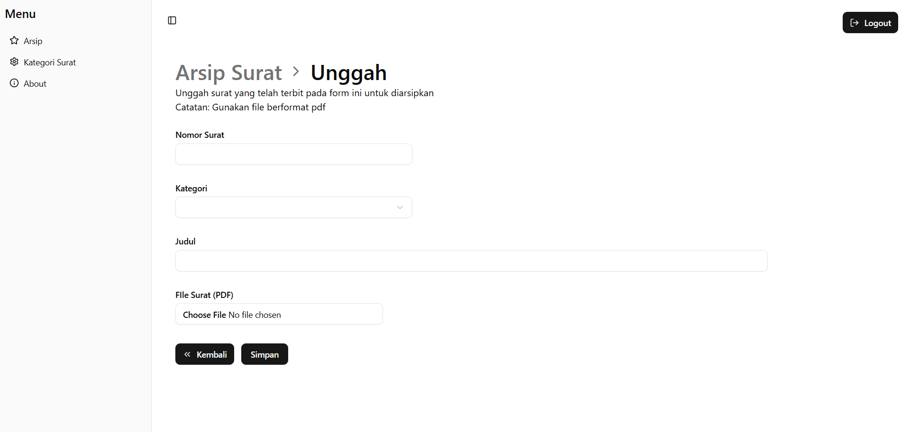
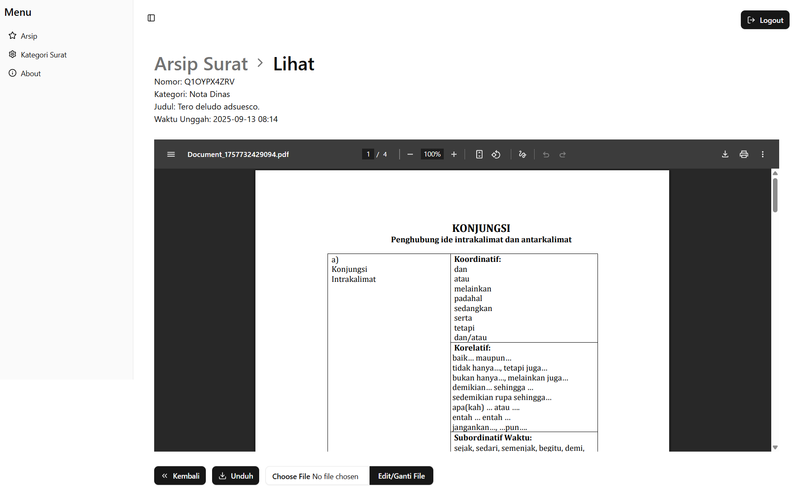
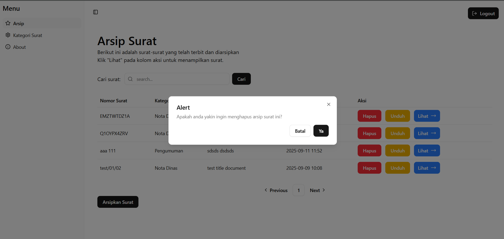
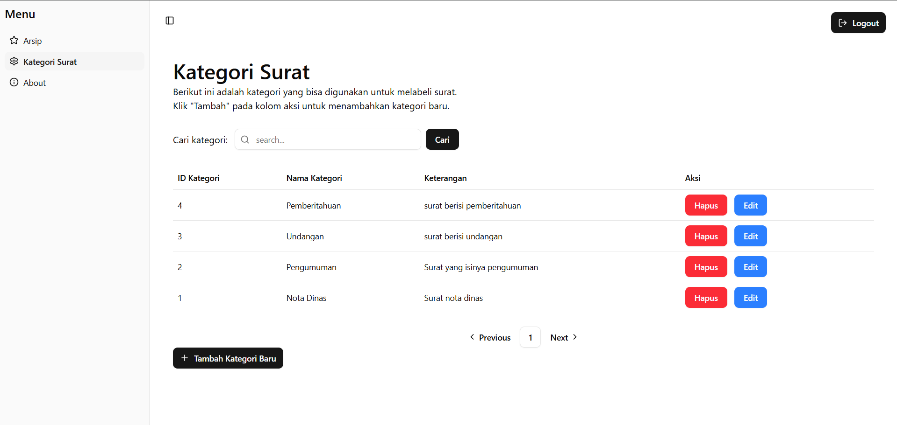
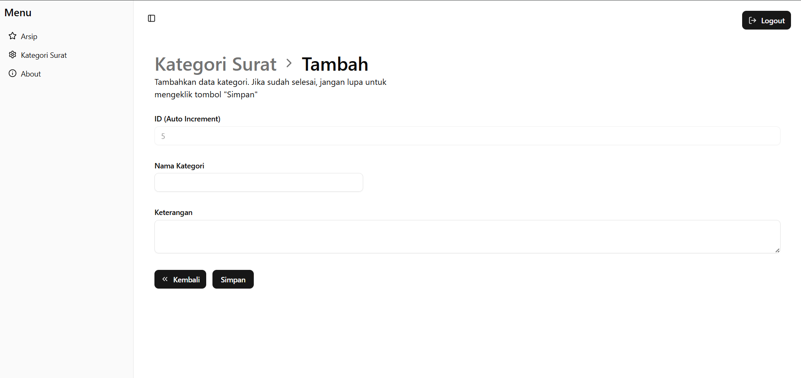
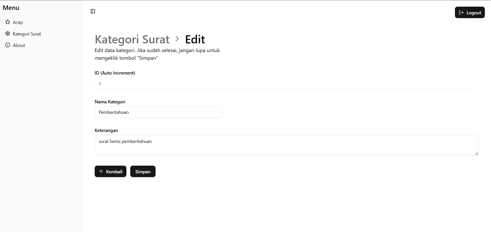

# 📑Sistem Informasi untuk Pengelolaan Arsip Surat


## 🎯Tujuan
- Menyediakan sistem penyimpanan arsip surat digital dalam format PDF.  
- Memudahkan perangkat desa dalam melakukan pencarian surat berdasarkan judul.  
- Mempermudah proses pengunduhan surat ketika dibutuhkan kembali.  
- Mengurangi risiko kehilangan arsip surat fisik. 

## ✨ Fitur
- 📂 **Manajemen Arsip**: Mengelola data arsip surat dengan detail datanya adalah nomor surat, kategori surat, judul, waktu pengarsipan, file pdf arsip surat. 
- 🔍 **Pencarian Surat**: Mencari arsip berdasarkan judul surat. 
- 📂 **Manajemen Kategori Surat**: Mengelola data kategori surat dengan detail datanya adalah nama kategori dan keterangannya. 
- 🔍 **Pencarian Kategori Surat**: Mencari kategori surat berdasarkan nama atau keterangannya. 

## 🛠️ Kebutuhan Sistem
Pastikan telah menginstall:
- Node.js v22
- PostgreSQL

## 🚀 Cara Menjalankan Aplikasi
### 1. Clone Repository
```bash
// git clone
git clone https://github.com/argyaWicaksana/bnsp-certification.git
```

### 2. Menjalankan Backend
```bash
cd backend
npm install

// setup file .env
cp .env.example .env
// sesuaikan username dan password db di komputer

// run migrations
npx prisma migrate deploy

// generate prisma client
npx prisma generate

// jalankan backend
npm run dev
```

### 3. Menjalankan Frontend
```bash
cd frontend
npm install

// setup file .env
cp .env.example .env
// sesuaikan dengan url backendnya

// jalankan frontend
npm run dev
```

## 🖼️ Screenshot
### Halaman Arsip Surat


### Halaman Unggah Arsip Surat


### Halaman Lihat Arsip Surat


### Menghapus Arsip Surat


### Halaman Kategori Surat


### Halaman Tambah Kategori Surat


### Halaman Edit Kategori Surat

